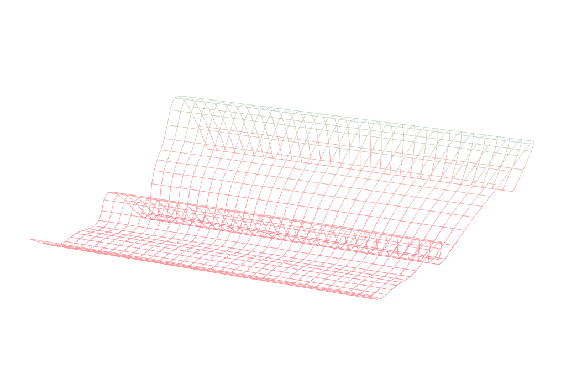
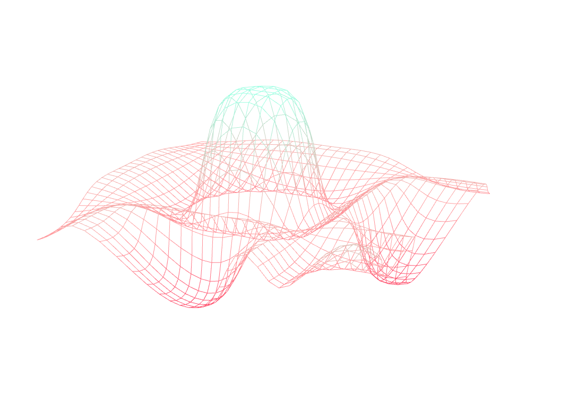
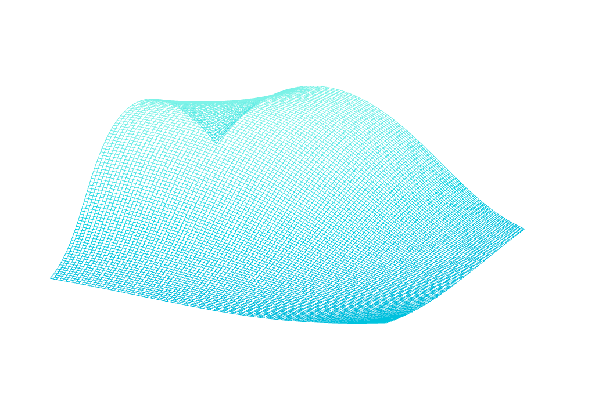
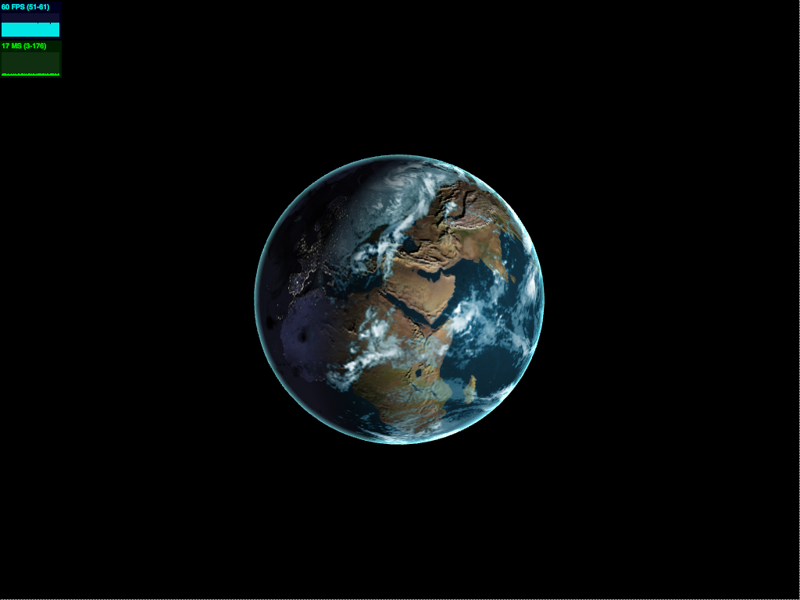

-------------------------------------------------------------------------------
CIS 565 : Project 5 : WebGL
-------------------------------------------------------------------------------
#Overview

In this project, we aim to work with WebGL to write vertex and fragment shaders. 
(Click picture to view demo.)
 
##Part 1

###Requirements:
* Sine Wave Vertex Shader 
* Simplex Wave Vertex Shader 
* 2D Simplex Wave Vertex Shader 

###Extra:
* Custom Simplex Wave Vertex Shader 
* (in development) Audio Driven Vertex Shader

##Part 2

###Requirements:
* Bump mapped terrain
* Rendering globe with day and night textures
* Smooth interpolation between day and night textures
* Specular mapping for water
* Rim lighting (post-process)
* Moving Clouds

###Extras:
* Procedural water rendering and animation using noise 

-----------

#Discussion

##Part 1

####2D Simplex Wave Vertex Shader

Taking the simplex wave that propagated along one-axis, we decided it would be 
interesting to see a simplex noise function that propagated in 2D.  In this 
version, we seed 2 different components of simplex noise: one using the position's
x componenet and the other using the position's y component. This produced a 
very box like function.  Thus, we added a final smoothing term that took 
both simplex noise components into account by using the product of the previous 
simplex noises as a seed against time.

####Custom Simplex Wave Vertex Shader

The custom vertex shader we have written takes a simple sine and cosine wave 
that decays the father away from (0,0) the position is.  Thus, we get interesting
oscilating waves that seem to propagate from (0,0) (or it just looks like an 
odd-out stingray, whichever you please).  

Interestingly enough, we had originally tried to do this from the center of the
mesh; however, when trying to figure out the length from the position of the 
vertex to (50, 50) (the center of the mesh), we had increasing trouble: the mesh
would not move at all or would oscillate as a parallel plane.

####Audio Drien Vertex Shader

With the introduction of HTML5, there has been a large push for audio standards
on the web.  Currently, standard is Web Audio API, backed mainly by Mozilla.  
The API features both ways to load local assets via AJAX/httpRequests, play/loop/etc.
 files, analyze via fast fourier transform and filter audio.  

Mostly out of curiosity, we are trying to create a simple 3D audio visualizer 
by taking the transformed audio data from the webpage drive the vertex shader
using such data.  Libraries such as ThreeAudio.js already do this. 
Currently, the biggest hurdle is data the transformed data 
and hooking it up to the shader.  As we would like to keep data from previous 
samples around, we believe that using a ring-buffer like structure to constantly
 load and offset the read will benefit the shader.  

##Part 2

#####Procedural water rendering and animation using noise

In order to generate and animation "waves" in the water, perturb the normal 
of the water in globe and use it as a modified bump map normal.  All of this 
is done in the fragment shader. First, we use the specular map to differentiate
between water and land. Since virtually none of the water has a bump texture
in the given bump map, we know that the x and y attributes of the resulting 
normal calculated from the right, above and center texels will return 0. 
Since we are primarily concerned with perturbing the texel-read normal in one direction 
(to look as if there is a different in height), we have used simplex noise to 
perturb the texel-read normal in the x direction. In order to animation the water, 
we add the u_time term to add periodicity of the osciallation of the simplex
noise.

-----------

#Performance Analysis

The following performance numbers are taken using Stats.js widget.  It is good
to note that this is not the most accurate way to measure the performance of 
WebGL, this widget gives approximate number based on the call time of the 
animate function, which is called for every frame.

###Integrated Graphics Card
Program | FPS | ms per frame
----| ----- | -----
Globe | 32 FPS | 32 ms
Sine Wave | 37 FPS | 27 ms
Custom Wave | 36 FPS | 28 ms
Simplex Wave | 38 FPS | 24 ms
Simplex 2D | 38 FPS | 27 ms

###GPU Enabled
Program | FPS | ms per frame
---- | ---- | ----
Globe | 60 FPS | 17 ms
Sine Wave | 60 FPS | 17 ms
Custom Wave | 60 FPS | 17 ms
Simplex | 60 FPS | 17 ms
Simplex 2D | 60 FPS | 17 ms

NOTE : All of these were taken from the github hosted versions on the 
same internet connection.

-----------

#Acknowledgements

Much of the audio visualizer code is based off the following tutorials and 
discussion of the current uses of Web Audio API:

-----------

#External Libraries

-----------

#Miscellaneous

##GPU Specs
NVIDIA GeFore 650M

##Integrated Card Specs
Intel HD Graphics 4000
