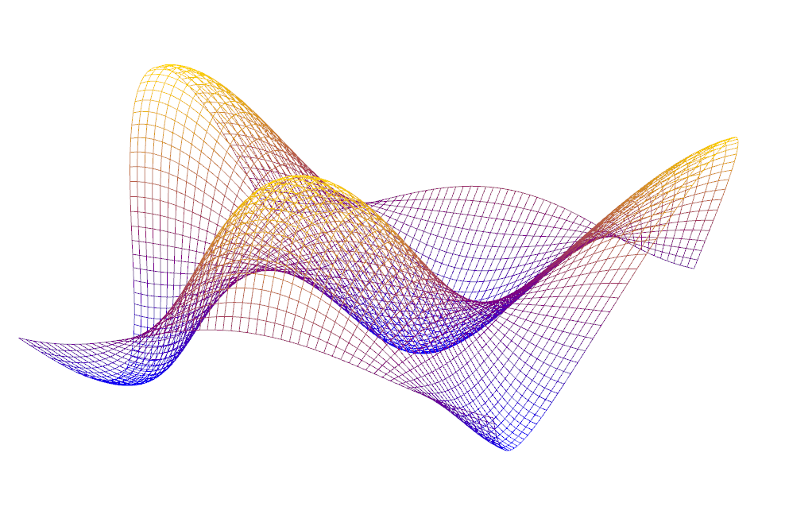
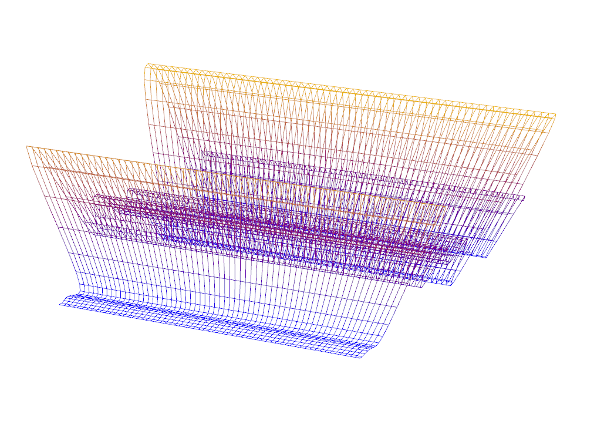
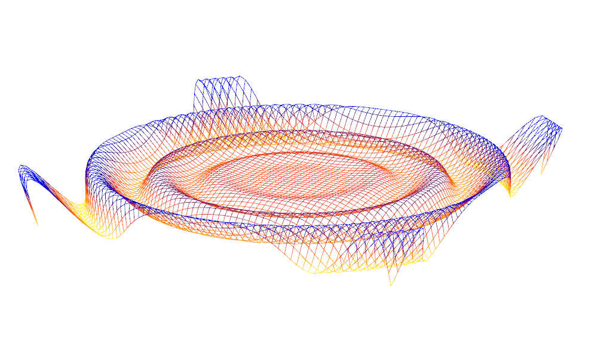
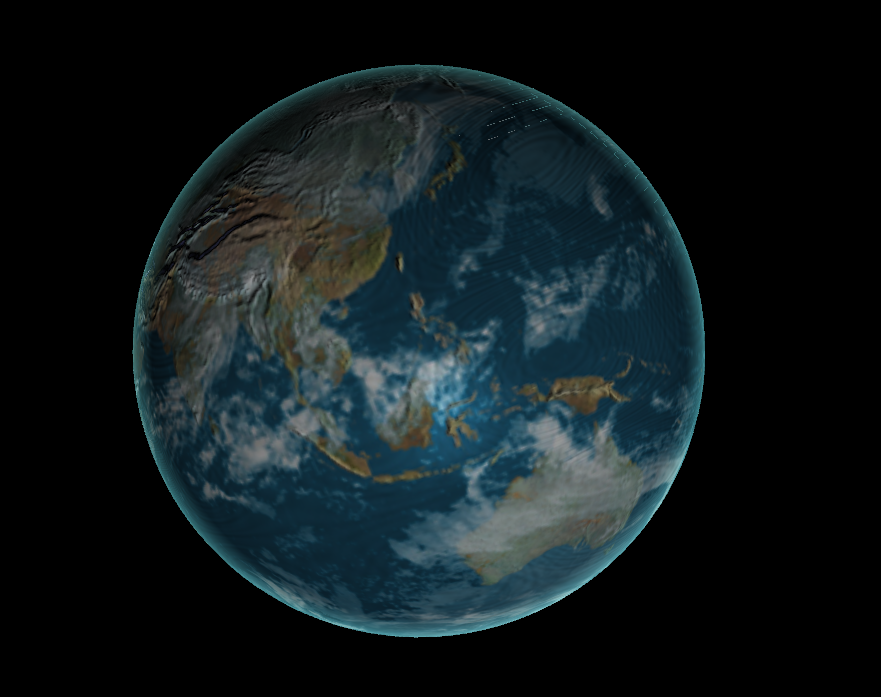
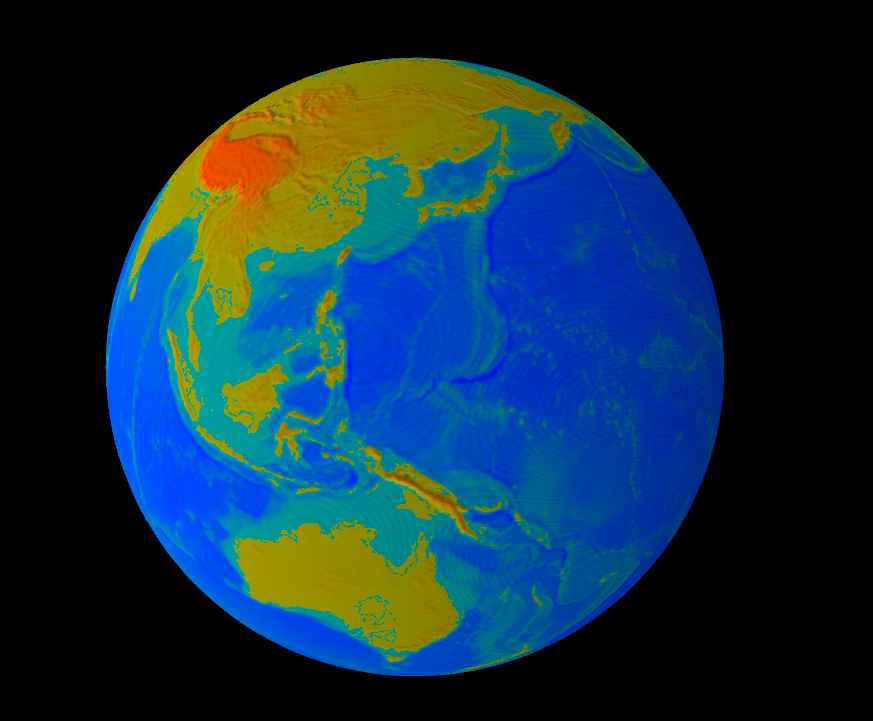

-------------------------------------------------------------------------------
CIS565: Project 5: WebGL
-------------------------------------------------------------------------------
Fall 2013

-------------------------------------------------------------------------------
PART 1
-------------------------------------------------------------------------------
**Sine Wave**

**Simplex Wave**

**Sin/cos wave using concentric circles**

For this wave, I offset the vertices using sin/cos functions based on how fart
the vertex is from the center of the grid. The points furthest away have the most
displacement.

-------------------------------------------------------------------------------
PART 2
-------------------------------------------------------------------------------

**Globe with procedurally animated water**

**Elevation map with bump mapping**

Press the 1 key to see the elevation map render.

[Here](https://vimeo.com/78964561) is a video of the wave and the globe running 
on Firefox.

-------------------------------------------------------------------------------
GH-PAGES
-------------------------------------------------------------------------------
Since this assignment is in WebGL you will make your project easily viewable by 
taking advantage of GitHub's project pages feature.

Once you are done you will need to create a new branch named gh-pages:

`git branch gh-pages`

Switch to your new branch:

`git checkout gh-pages`

Create an index.html file that is either your renamed frag_globe.html or 
contains a link to it, commit, and then push as usual. Now you can go to 

`<user_name>.github.io/<project_name>` 

to see your beautiful globe from anywhere.

-------------------------------------------------------------------------------
PERFORMANCE EVALUATION
-------------------------------------------------------------------------------
I used stats.js from https://github.com/mrdoob/stats.js/ to benchmark my WebGL 
application. Both the wave and globe ran at 60 fps. 
The elevation map ran slightly faster than the full render since there is no
specular calculation and no cloud animations. 
For the wave, performace stayed steady at 60fps for small and medium sized grids. 
Performance dropped to to about 55 fps when the grid is 1024*1024, and to 45 fps 
at a grid size of 2048*2048. 