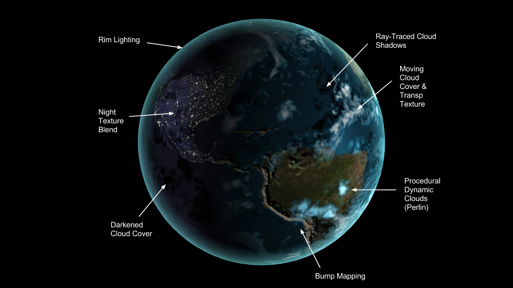

-------------------------------------------------------------------------------
CIS565: Project 5: WebGL
-------------------------------------------------------------------------------
Fall 2013

---
Part 1: Vertex Shader Shenanigans
---

Some screenshots to begin!

Click the image to open a demo

Details:
* The simple wave is just a sin wave that goes up and down based on the x and z coordinage
* The simplex noise function is used in 2D to generate a moving height field sort of effect.
* The last one is an infinitely tiled, pseudo random terrain generation

For the pseudo-random infinitely tiled terrain generation, I used a combination of a tiled noise texture along with the simplex noise function to create a time-dependent but yet infinitely tiled terrain which is false colored for visualization.

---
Part 2: Globe Rendering
---

Click the image to open a demo

Extra Features:
* Perlin Noise function based dynamic random clouds (clouds go in and out)
* Ray Traced cloud shadows (including the procedural clouds)
 
Required Features:
* Day Textures
* Specular Maps
* Night Textures
* Cloud Textures
* Cloud Transparencies
* Bump Mapping

---
Performance Evaluation
---
Measuring performance for shaders is a really difficult thing to do, especially in webGL, so the closest I could get was average FPS.
Vertex Shader Sine Wave: ~33fps
Vertex Shader Simplex Wave: ~28fps
Vertex Shader Infinitely Tiled Pseudo Random Terain: ~48fps
Globe Shader : 61fps

The globe takes a long time to load since the fragment shader is quite long with its noise function.
None the less, the execution time is much more for the vertex shader programs since they are bound by the number of vertices (512x512) and have complex sin-cos functions involved.
But the shader should have fast hardware sin-cos. So I'm not entirely sure why it's so much faster for the globe when I'm doing some quite complex things.