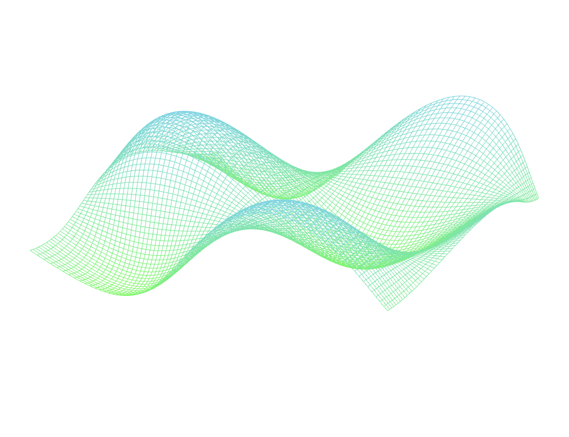
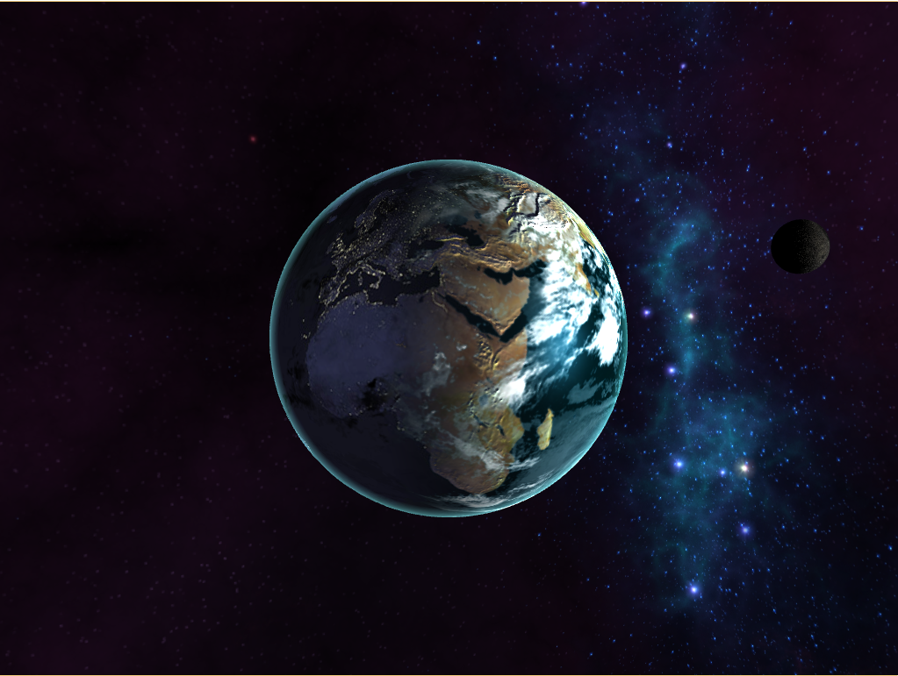

CIS565: Project 5: WebGL
-------------------------------------------------------------------------------

INTRODUCTION:
-------------------------------------------------------------------------------
This project contains 2 main portions. The first part is a visualization of various math functions. 
The second portion is an interactive globe with orbiting moon and skybox. Read on for more details!

PART 1 - VISUALIZING FUNCTIONS
-------------------------------------------------------------------------------
For this part, I have implemented shaders for the following using glsl:
* A sin-wave based vertex shader
* A simplex noise based vertex shader
* A custom vertex shader that behaves like waves

Below are the links to the live demos:

[Sin/Cos](http://mikeychen.net/WebGL/MathFunctionsVisualization/vert_wave.html)

[Simplex Noise](http://mikeychen.net/WebGL/MathFunctionsVisualization/simplex_wave.html)

[Waves](http://mikeychen.net/WebGL/MathFunctionsVisualization/custom_wave.html)

PART 2 - GLOBE
-------------------------------------------------------------------------------
For this part, I have implemented the following features:

* Bump mapped terrain
* Rim lighting to simulate atmosphere
* Night-time lights on the dark side of the globe
* Specular mapping
* Moving clouds
* Orbiting Moon with texture mapping and bump mapping
* Skybox around the entire scene

Below is the links to the live demo:

[Globe](http://mikeychen.net/WebGL/Globe/frag_globe.html)

PERFORMANCE EVALUATION
-------------------------------------------------------------------------------
I used a simple timing mechanism to time the execution duration (rendering) of each feature in part 2.
Below are the results.

| Earth | Moon | Skybox |
| ----- | ---- | ------ |
| 23ms  | 8ms  | 4ms |

REFERENCES
-------------------------------------------------------------------------------
For doing rim lighting, [this article](http://www.fundza.com/rman_shaders/surface/fake_rim/fake_rim1.html) was referred to. I also consulted 
a [General WebGL Tutorial](https://developer.mozilla.org/en-US/docs/Web/WebGL) found here. Finally, the skybox images were generated with 
[Spacescape](http://sourceforge.net/projects/spacescape/).
