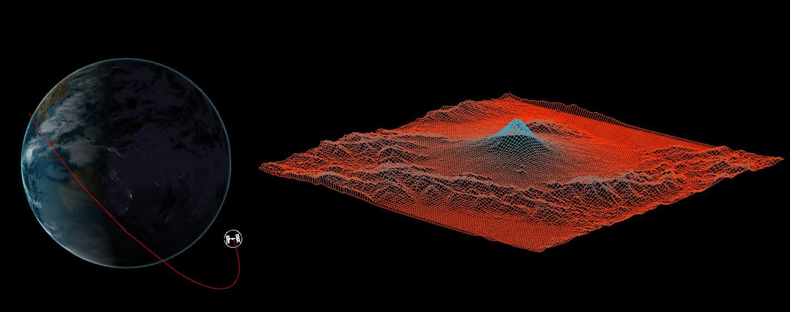
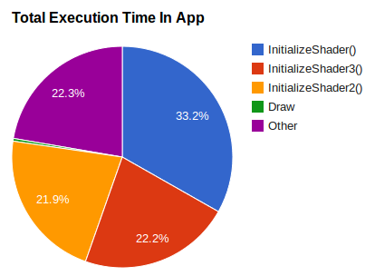
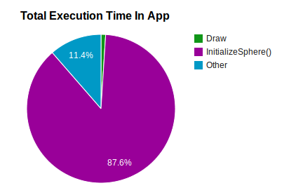
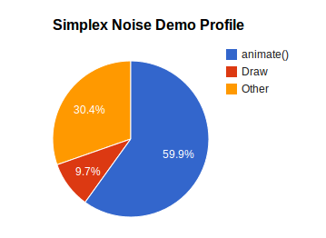

-------------------------------------------------------------------------------
Terrain Morphing Plus ISS Tracker
--------------------------------------------------------------------------------

* DISCLAIMER 1: Right now this project is ONLY compatible with Firefox! Fixes for Chrome coming soon!
* DISCLAIMER 2: You might have to wait a little bit for texture data to load, since the globe and terrain renderers use high-res textures!

-------------------------------------------------------------------------------
Terrain Morphing
-------------------------------------------------------------------------------
The first part of this project is a WebGL terrain renderer. [Click HERE to see it.](http://nmarshak1337.github.io/Project5-WebGL/part1/terrain_render.html). [Click HERE to see a video](http://youtu.be/2DtJ2FN_TD8).

* The terrain renderer uses height field (DEM) data from NASA ASTER (Mt. Fuji) and the USGS (Mt. Rainier). 
* I followed a [forum post by TrickyVein](http://forums.nexusmods.com/index.php?/topic/517230-tutorial-converting-a-dem-to-a-heightmap/) to convert DEM data to a heightmap. I also wrote [my own tutorial](http://lightspeedbanana.blogspot.com/2013/11/getting-nasa-height-field-data.html) on how to get data from the USGS.
* I perform morphing in the vertex shader by reading two height fields as textures, blending, then using the blended result to perturb the vertices:

```glsl
    float height1 = texture2D(u_Height, texCoord).r; 
    float height2 = texture2D(u_Height2, texCoord).r; 
    float height = mix(height1, height2, u_heightBlend); 
    gl_Position = u_modelViewPerspective * vec4(vec3(position, 0.5*height), 1.0);
```

* In addition to rendering terrain, I can render simple waves, using the vertex shader to perturb the normals: [Simplex Wave Demo](http://nmarshak1337.github.io/Project5-WebGL/part1/index_simplex.html), [Sine/Cosine Wave Demo](http://nmarshak1337.github.io/Project5-WebGL/part1/vert_wave.html).

-------------------------------------------------------------------------------
ISS Tracker
-------------------------------------------------------------------------------
Part 3 of this project is an app that tracks the ISS, which I bolted on to Part 2, which is a virtual globe. [Click HERE to see it.](http://nmarshak1337.github.io/Project5-WebGL/part3/frag_globe.html). [Click HERE to see a video](http://youtu.be/e8fi5EmaTbo).

* I use the [ISS Now API](http://open-notify.org/Open-Notify-API/ISS-Location-Now/) to get the latitude and longitude of the ISS. I poll once every five seconds.
* The API does not provide previous ISS positions, so I draw a trail starting from when the app is opened.
* The day/night on the globe approximates day/night in real time (I do not account for the Earth's tilt). I do
this by getting UTC time, then offsetting so that day/night is correct in the UTC time zone (and therefore for everywhere else): 

```javascript
    var myDate = new Date();
    var hour = myDate.getUTCHours();
    var minutes = myDate.getUTCMinutes() / 60.0;
    var seconds = myDate.getUTCSeconds() / 3600.0;
    hour = hour + minutes + seconds;
    //Math.PI is used to offset because we are using GMT time. 
    var lightAngle = ((12.0 - hour)/24.0) * 2.0 * Math.PI + -Math.PI/2.0;
    var lightdir = vec3.create([Math.sin(lightAngle), 0.0, Math.cos(lightAngle)]);
```

-------------------------------------------------------------------------------
Performance Analysis
-------------------------------------------------------------------------------
* In order to draw the globe, ISS icon, and trail in my ISS tracker, I had to use three separate fragment shaders. Here are my initial results from profiling my app using Firefox's developer console:



* Why were initializing the shaders so time consuming? It turned out that I was compiling the shaders at every animation frame! Clearly very inefficient. After compiling the shaders ONCE, then using gl.useProgram() to switch between shaders, the pie chart looks like the image below. The InitializeShader() calls are considered by the profiler to take up 0% of the execution time:



* The problem above is that I'm now setting up the sphere in each animation frame. Further optimizations could be done by moving the setup to a precompute step. In general it seems that the draw call is not very time consuming - rather packaging the data and sending to the GPU is the bottleneck. Below is another example from the simplex wave demo, which has a modestly complex vertex vertex shader. Again, the shaders aren't the performance bottleneck. Rather, it's the animate() call that sets up the shader, and other logic done in JavaScript: 


