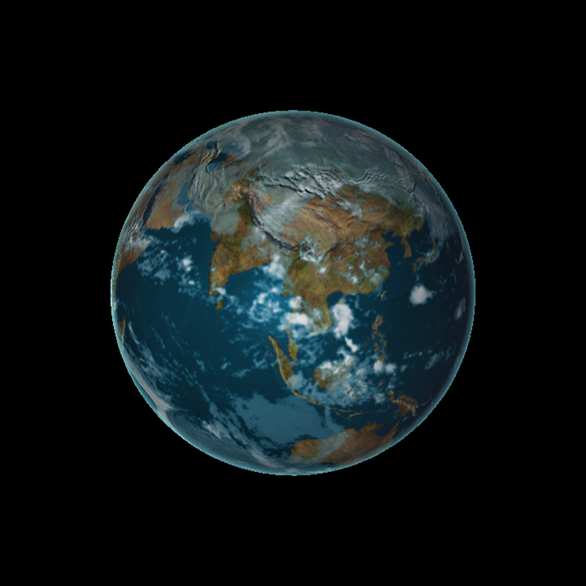
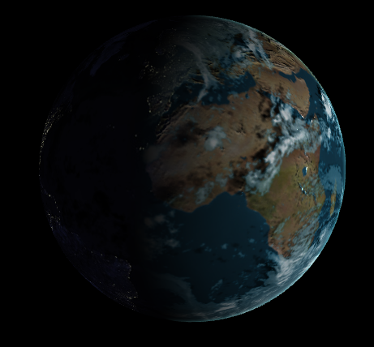
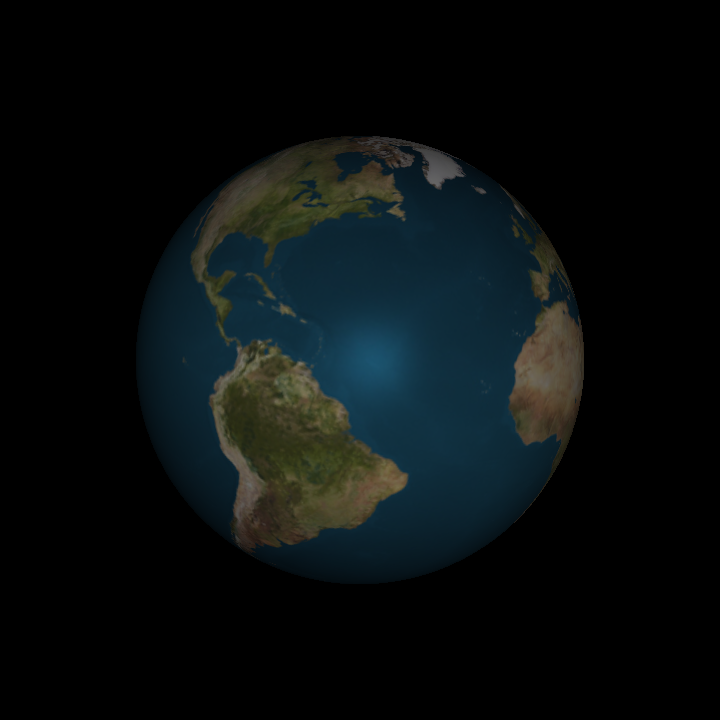
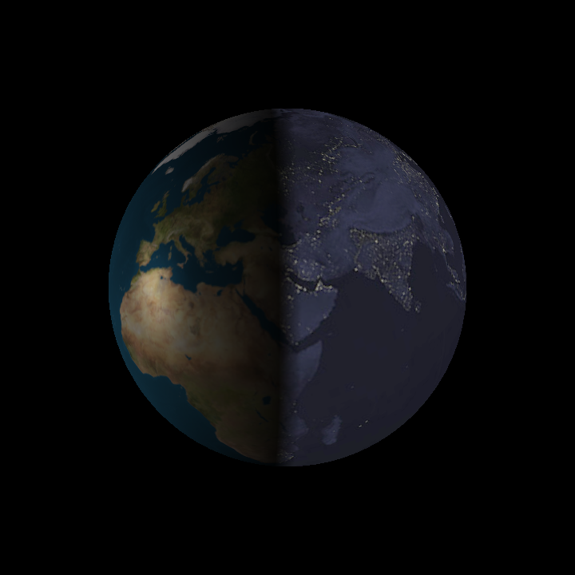
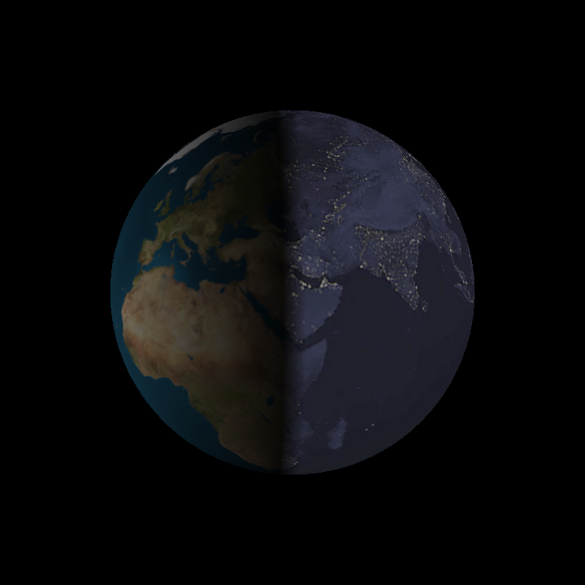
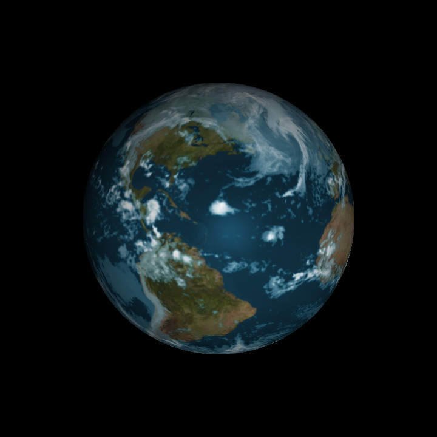
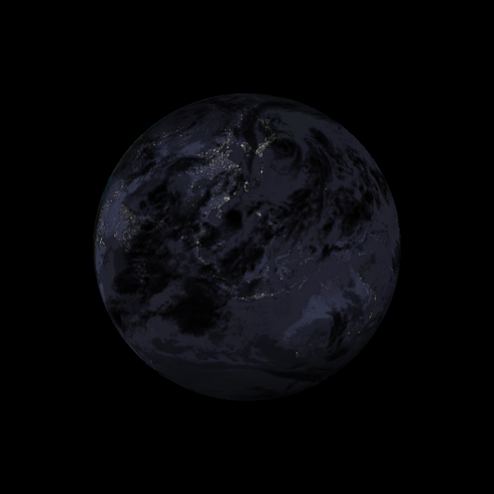
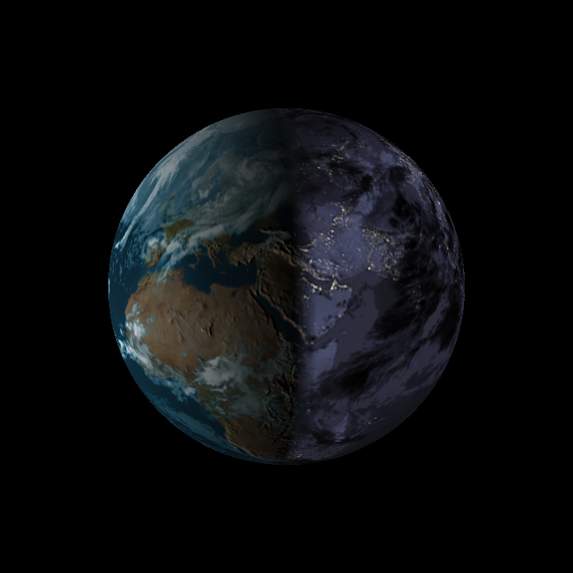

-------------------------------------------------------------------------------
WebGL Shaders (Simple Waves and Globe Rendering)
-------------------------------------------------------------------------------
Fall 2013
-------------------------------------------------------------------------------


<iframe src="http://cboots.github.io/WebGL-Waves-and-Globe/waves/vert_wave.html" width="200" height="200"></iframe> 


-------------------------------------------------------------------------------
NOTE:
-------------------------------------------------------------------------------
This project requires any graphics card with support for a modern OpenGL 
pipeline. Any AMD, NVIDIA, or Intel card from the past few years should work 
fine, and every machine in the SIG Lab and Moore 100 is capable of running 
this project.

This project also requires a WebGL capable browser. The project is known to 
have issues with Chrome on windows, but Firefox seems to run it fine.

-------------------------------------------------------------------------------
Wave Rendering
-------------------------------------------------------------------------------
This section is just a simple demo of JS/WebGL Interaction and shader implementation.
Three different waveforms can be animated:

**Sine Wave**

* Open vert_wave.html to see this animation.
* The 2D sine wave is generated by varying only the height of each vertex in the grid.


**Simplex Wave**

* Open simplex_wave.html to see this animation.

**Water Surface Wave**

* Open water_wave.html to see this animation.
* Unlike the previous waves, this wave moves verticies in all directions.
* Each vertex is moved uniformly about a circle in some vertical plane
	* This plane can be set in the VS by changing waveDir
* The phase of each point is determined by their distance from the origin in the waveDir direction, resulting in linear wavefronts.
* This simulates in a very simple way how particles move in the surface of ocean waves.

-------------------------------------------------------------------------------
PART 2 REQUIREMENTS:
-------------------------------------------------------------------------------
In Part 2, you are given code for:

* Reading and loading textures
* Rendering a sphere with textures mapped on
* Basic passthrough fragment and vertex shaders 
* A basic globe with Earth terrain color mapping
* Gamma correcting textures
* javascript to interact with the mouse
  * left-click and drag moves the camera around
  * right-click and drag moves the camera in and out

You are required to implement:

* Bump mapped terrain
* Rim lighting to simulate atmosphere
* Night-time lights on the dark side of the globe
* Specular mapping
* Moving clouds

You are also required to pick one open-ended effect to implement:

* Procedural water rendering and animation using noise 
* Shade based on altitude using the height map
* Cloud shadows via ray-tracing through the cloud map in the fragment shader
* Orbiting Moon with texture mapping and shadow casting onto Earth
* Draw a skybox around the entire scene for the stars.
* Your choice! Email Liam and Patrick to get approval first

Finally in addition to your readme, you must also set up a gh-pages branch 
(explained below) to expose your beautiful WebGL globe to the world.

Some examples of what your completed globe renderer will look like:



Figure 0. Completed globe renderer, daylight side.



Figure 1. Completed globe renderer, twilight border.


Figure 2. Completed globe renderer, night side.

-------------------------------------------------------------------------------
PART 2 WALKTHROUGH:
-------------------------------------------------------------------------------

Open part2/frag_globe.html in Firefox to run it. You’ll see a globe 
with Phong lighting like the one in Figure 3. All changes you need to make 
will be in the fragment shader portion of this file.



Figure 3. Initial globe with diffuse and specular lighting.

**Night Lights**

The backside of the globe not facing the sun is completely black in the 
initial globe. Use the `diffuse` lighting component to detect if a fragment 
is on this side of the globe, and, if so, shade it with the color from the 
night light texture, `u_Night`. Do not abruptly switch from day to night; 
instead use the `GLSL mix` function to smoothly transition from day to night 
over a reasonable period. The resulting globe will look like Figure 4. 
Consider brightening the night lights by multiplying the value by two. 

The base code shows an example of how to gamma correct the nighttime texture:

```glsl
float gammaCorrect = 1/1.2;
vec4 nightColor = pow(texture2D(u_Night, v_Texcoord), vec4(gammaCorrect));
```

Feel free to play with gamma correcting the night and day textures if you 
wish. Find values that you think look nice!



Figure 4. Globe with night lights and day/night blending at dusk/dawn.

**Specular Map** 

Our day/night color still shows specular highlights on landmasses, which 
should only be diffuse lit. Only the ocean should receive specular highlights. 
Use `u_EarthSpec` to determine if a fragment is on ocean or land, and only 
include the specular component if it is in ocean.



Figure 5. Globe with specular map. Compare to Figure 4. Here, the specular 
component is not used when shading the land.

**Clouds**

In day time, clouds should be diffuse lit. Use `u_Cloud` to determine the 
cloud color, and `u_CloudTrans` and `mix` to determine how much a daytime 
fragment is affected by the day diffuse map or cloud color. See Figure 6.

In night time, clouds should obscure city lights. Use `u_CloudTrans` and `mix` 
to blend between the city lights and solid black. See Figure 7.

Animate the clouds by offseting the `s` component of `v_Texcoord` by `u_time` 
when reading `u_Cloud` and `u_CloudTrans`.



Figure 6. Clouds with day time shading.



Figure 7. Clouds observing city nights on the dark side of the globe.

**Bump Mapping**

Add the appearance of mountains by perturbing the normal used for diffuse 
lighting the ground (not the clouds) by using the bump map texture, `u_Bump`. 
This texture is 1024x512, and is zero when the fragment is at sea-level, and 
one when the fragment is on the highest mountain. Read three texels from this 
texture: once using `v_Texcoord`; once one texel to the right; and once one 
texel above. Create a perturbed normal in tangent space:

`normalize(vec3(center - right, center - top, 0.2))`

Use `eastNorthUpToEyeCoordinates` to transform this normal to eye coordinates, 
normalize it, then use it for diffuse lighting the ground instead of the 
original normal.



Figure 8. Bump mapping brings attention to mountains.

**Rim Lighting**

Rim lighting is a simple post-processed lighting effect we can apply to make 
the globe look as if it has an atmospheric layer catching light from the sun. 
Implementing rim lighting is simple; we being by finding the dot product of 
`v_Normal` and `v_Position`, and add 1 to the dot product. We call this value 
our rim factor. If the rim factor is greater than 0, then we add a blue color 
based on the rim factor to the current fragment color. You might use a color 
something like `vec4(rim/4, rim/2, rim/2, 1)`. If our rim factor is not greater 
than 0, then we leave the fragment color as is. Figures 0,1 and 2 show our 
finished globe with rim lighting.

For more information on rim lighting, 
read http://www.fundza.com/rman_shaders/surface/fake_rim/fake_rim1.html.

-------------------------------------------------------------------------------
GH-PAGES
-------------------------------------------------------------------------------
Since this assignment is in WebGL you will make your project easily viewable by 
taking advantage of GitHub's project pages feature.

Once you are done you will need to create a new branch named gh-pages:

`git branch gh-pages`

Switch to your new branch:

`git checkout gh-pages`

Create an index.html file that is either your renamed frag_globe.html or 
contains a link to it, commit, and then push as usual. Now you can go to 

`<user_name>.github.io/<project_name>` 

to see your beautiful globe from anywhere.

-------------------------------------------------------------------------------
README
-------------------------------------------------------------------------------
All students must replace or augment the contents of this Readme.md in a clear 
manner with the following:

* A brief description of the project and the specific features you implemented.
* At least one screenshot of your project running.
* A 30 second or longer video of your project running.  To create the video you
  can use http://www.microsoft.com/expression/products/Encoder4_Overview.aspx 
* A performance evaluation (described in detail below).

-------------------------------------------------------------------------------
PERFORMANCE EVALUATION
-------------------------------------------------------------------------------
The performance evaluation is where you will investigate how to make your 
program more efficient using the skills you've learned in class. You must have
performed at least one experiment on your code to investigate the positive or
negative effects on performance. 

We encourage you to get creative with your tweaks. Consider places in your code
that could be considered bottlenecks and try to improve them. 

Each student should provide no more than a one page summary of their
optimizations along with tables and or graphs to visually explain any
performance differences.

-------------------------------------------------------------------------------
THIRD PARTY CODE POLICY
-------------------------------------------------------------------------------
* Use of any third-party code must be approved by asking on the Google groups.  
  If it is approved, all students are welcome to use it.  Generally, we approve 
  use of third-party code that is not a core part of the project.  For example, 
  for the ray tracer, we would approve using a third-party library for loading 
  models, but would not approve copying and pasting a CUDA function for doing 
  refraction.
* Third-party code must be credited in README.md.
* Using third-party code without its approval, including using another 
  student's code, is an academic integrity violation, and will result in you 
  receiving an F for the semester.

-------------------------------------------------------------------------------
SELF-GRADING
-------------------------------------------------------------------------------
* On the submission date, email your grade, on a scale of 0 to 100, to Liam, 
  liamboone@gmail.com, with a one paragraph explanation.  Be concise and 
  realistic.  Recall that we reserve 30 points as a sanity check to adjust your 
  grade.  Your actual grade will be (0.7 * your grade) + (0.3 * our grade).  We 
  hope to only use this in extreme cases when your grade does not realistically 
  reflect your work - it is either too high or too low.  In most cases, we plan 
  to give you the exact grade you suggest.
* Projects are not weighted evenly, e.g., Project 0 doesn't count as much as 
  the path tracer.  We will determine the weighting at the end of the semester 
  based on the size of each project.


---
SUBMISSION
---
As with the previous project, you should fork this project and work inside of
your fork. Upon completion, commit your finished project back to your fork, and
make a pull request to the master repository.  You should include a README.md
file in the root directory detailing the following

* A brief description of the project and specific features you implemented
* At least one screenshot of your project running.
* A link to a video of your project running.
* Instructions for building and running your project if they differ from the
  base code.
* A performance writeup as detailed above.
* A list of all third-party code used.
* This Readme file edited as described above in the README section.
