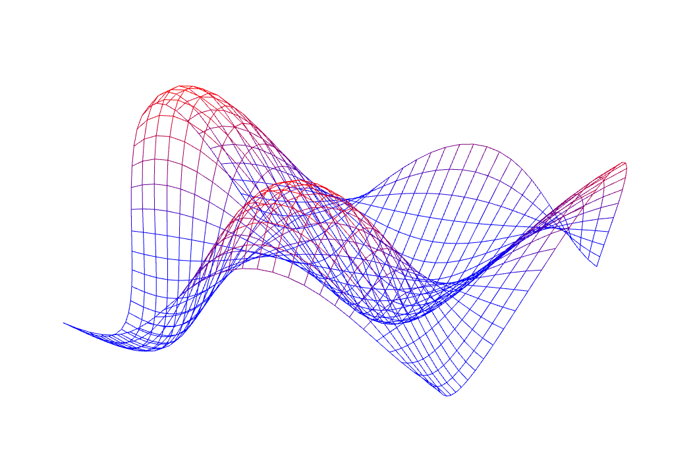
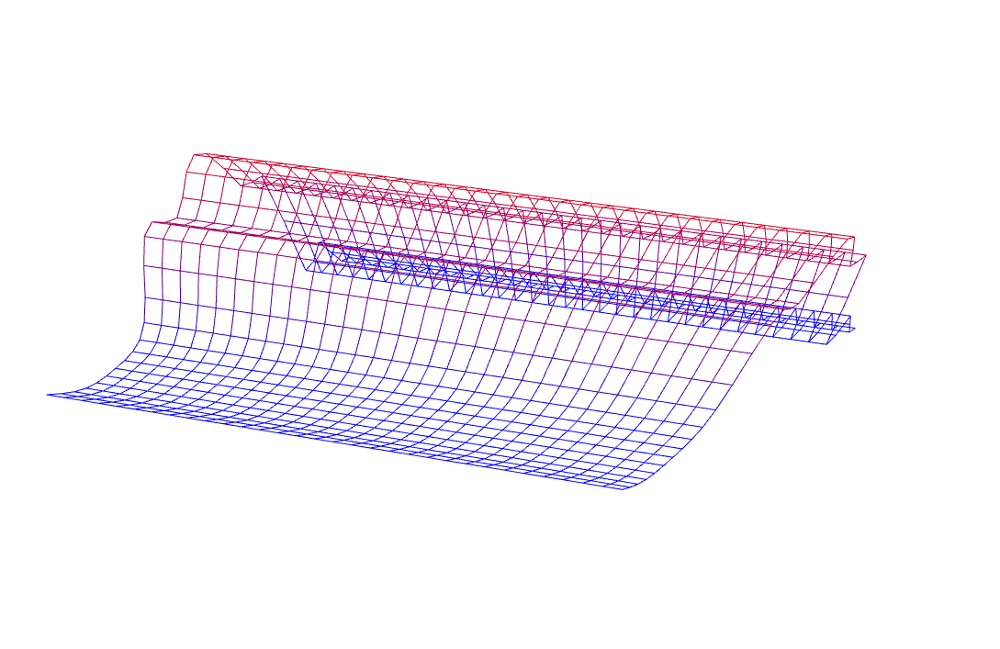
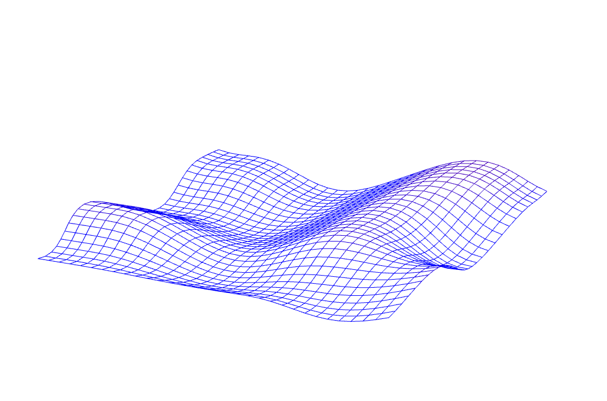
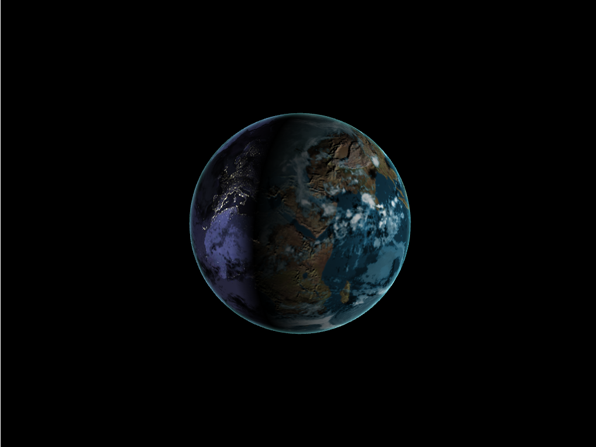

-------------------------------------------------------------------------------
#CIS565: Project 5: WebGL
-------------------------------------------------------------------------------
# Part 1:  
Part 1 implements three types of vertex shader:
 ## Sine-wave:  
  
 ## Simplex noise:  
  
 ## Perlin noise:  
  
 This WebGL implementation of Perlin noise is based on [Perlin's IMPROVED noise algorithm](http://mrl.nyu.edu/~perlin/noise/) and 
 the corresponding [Direct3D Effects implementation](http://http.developer.nvidia.com/GPUGems2/gpugems2_chapter26.html).  
 Because the permutation and gradient tables are stored as textures, filtering should be turned off on these textures:  
 
		context.texParameteri(context.TEXTURE_2D, context.TEXTURE_MAG_FILTER, context.NEAREST );  
		context.texParameteri(context.TEXTURE_2D, context.TEXTURE_MIN_FILTER, context.NEAREST );

 
# Part 2:  
 Part 2 renders an Earth globe with the following effects:  
 * Day/night lighting
 * Moving clouds
 * Bump-mapped terrain
 * Rim-light factor
 * Cloud shadow  
 
   
 
 To create cloud shadow effect, the following steps are taken:  
 * Transform light rays to the lit point's tangent space.
 * Calcuate the offset of texture coordinates on the lit point based on the light rays and the height of cloud.
 * If the cloud density at the location of offsetted texture coordinates is not zero, then the lit point should be shadowed by the cloud. 