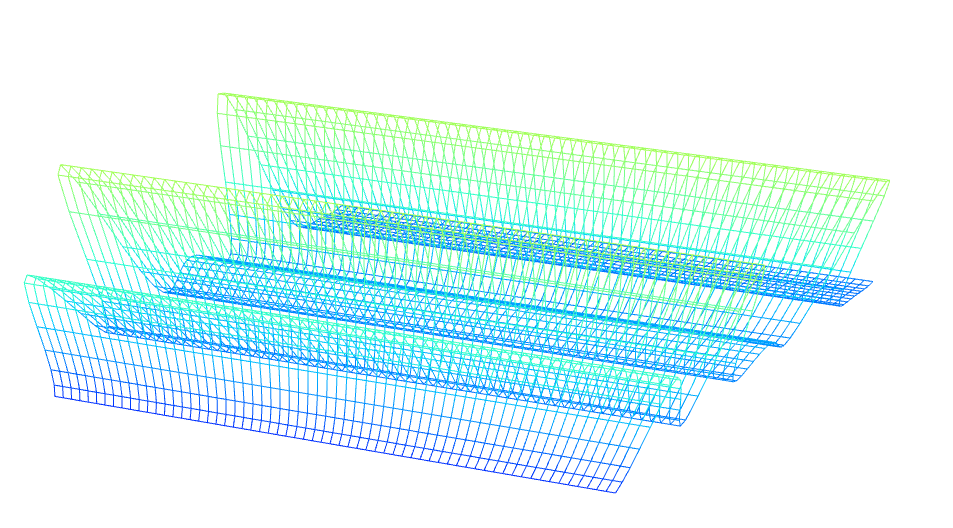

#My First WebGL #

## Description ##

**Part 1 Waves**

In part 1, I implemented sin-wave based vertex shader

and a simplex noise based vertex shader

Also, I implemented a water ripple like wave based on vertex shader

**Part 2 Globe**

[](http://tiansijie.github.io/Project5-WebGL/ "

[](http://tiansijie.github.io/Project5-WebGL/ "

click image to view online

For the second part, I implemented:

* Bump mapped terrain
* Rim lighting to simulate atmosphere
* Night-time lights on the dark side of the globe
* Specular mapping
* Moving clouds

Expect for this basic functions, I added a procedural water rendering and animation and a skybox.

For the procedural water rendering, I am using the techniques similar to bump mapping. First, I am using local coordinate for simplex function to generate the random number for center position. As same as bump mapping, generating the above and right value using simplex function. After this, you can get the perturbed normal which can help you to get the normal in tangent space. I use this tangent normal for calculating the specular effect. 

I get the skybox image from [http://gfx.quakeworld.nu/details/266/space/](http://gfx.quakeworld.nu/details/266/space/)

##Performance Evaluation##

I calculate the elapsed time between each call for the animate() function, the time for rendering the globe, skybox and procedure water is around 0.001 s.

After I disable the skybox, the time is around the same, approximately 0.0099s

I also try to disable the procedure water rendering, the elapsed time is still the same.

