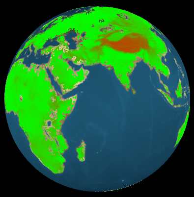
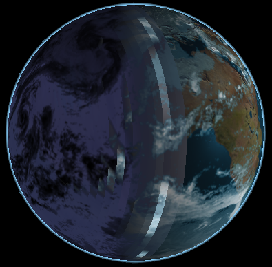

#CIS565: Project 5: WebGL Globe  
##a.k.a. WebGLobe
  
An introductory project in GLSL for the CIS 565 course. Since it uses WebGL, it 
was only possible to write vertex and fragment shaders for this project. 
  
>> [LIVE DEMO!](http://rohith10.github.io/WebGLobe/)  
  
There were two parts: 

In the first part of this project, I wrote simple vertex shaders to implement 
functions that would displace vertices in a wave-like pattern. Waves implemented were 
a sine wave, a simplex noise-based wave and a sawtooth wave as below:  
  
**Sine Wave**:  
  
  
**Simplex-Noise based wave**:  
  
  
**Sawtooth Wave**:  
  
  
**The result of tinkering around with WebGL**:  
  
  
  
In the second part of this project, I (mainly) wrote a fragment shader to render an 
interactive globe in WebGL, implementing texture blending, bump and parallax occlusion mapping, 
specular masking and a cloud layer based off a texture. Below are some screenshots:  
  
**Day**:  
  
**Dusk**:  
  
**Night**:  
  
**Dawn**:  
  
**Heightmap** (Press 'H'):  
  

**Blooper: Incorrect Parallax Occlusion Mapping** (due to marching beyond radius of sphere):
  

##Features that I'm working on  
###(that are not quite ready for primetime, yet)
*  Shadow mapping
*  Skybox

##An unanswered question
###Parallax Occlusion Mapping
My original implementation of parallax occlusion mapping was based on the chapter *A Closer Look at 
Parallax Occlusion Mapping* from the book *Advanced Game Programming*, which itself follows the sample 
from the DirectX SDK quite faithfully. This method involves stepping through samples in the tangent 
space. A chat with our TA, William Boone, convinced me that this approach was not quite suited for 
spherical surfaces. As a result, I used an alternative implementation as depicted below:  
  
  
  
As can be seen, I'm stepping through in the view space, finding the intersection, retrieving the height 
value and calculating the offset. The height value is being read from the bump map texture, and I'm also 
building the normal from this bump map texture. However, the globe looks exactly the same regardless of 
whether I'm using parallax occlusion mapping or bump mapping. And, as can be seen from the blooper shot 
above, parallax occlusion mapping (as implemented here), is indeed working. Why is that? 
[Please help me figure out](mailto:rohith.chandran@outlook.com)!  
  
  
  
##Input/Interactive features  
  
<table>
<tr>
  <th>Key</th>
  <th>Function</th>       
</tr>
<tr>
  <td>'b' or 'B'</td>
  <td>Switch between ordinary bump and Parallax Occlusion mapping</td>
</tr>
<tr>
  <td>'h' or 'H'</td>
  <td>Visualise the heightfield like in a contour map</td>
</tr>
<tr>
  <td>'p' or 'P'</td>
  <td>Pause</td>
</tr>
</table>

