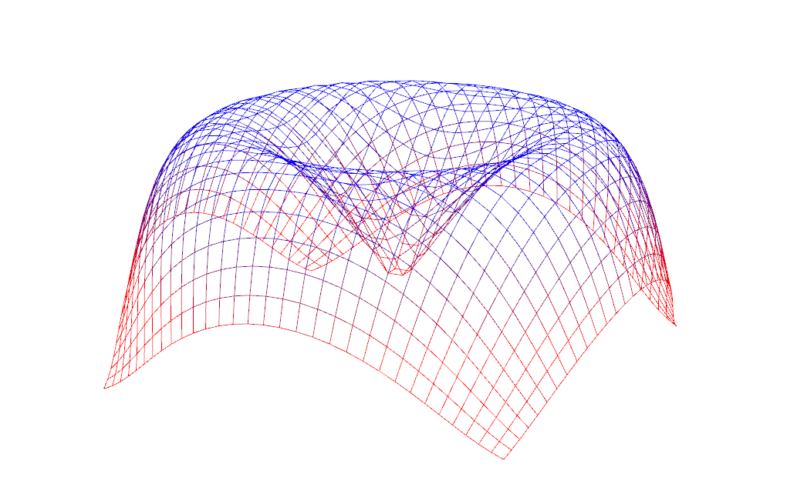

-------------------------------------------------------------------------------
WebGL
-------------------------------------------------------------------------------
Fall 2013
-------------------------------------------------------------------------------
Due Friday 11/08/2013
-------------------------------------------------------------------------------

Demo:

http://takfuruya.github.io/Project5-WebGL/index.html

Part 1

Part 2

Night-time lights on the dark side of the globe

Specular mapping

Moving clouds

Bump mapped terrain

Rim lighting to simulate atmosphere

Shade based on altitude using the height map

