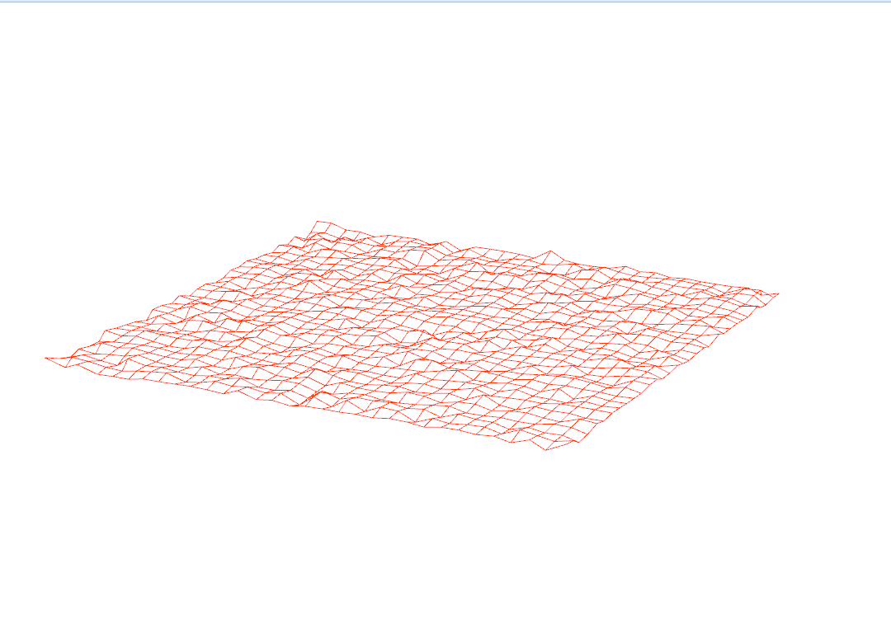

-------------------------------------------------------------------------------
WebGL Demos
-------------------------------------------------------------------------------
Fall 2013
-------------------------------------------------------------------------------

-------------------------------------------------------------------------------
DEMO1: Wire Frame Waves
-------------------------------------------------------------------------------
* A sin-wave based vertex shader:

* A simplex noise based vertex shader:

* Pseudo height field water

-------------------------------------------------------------------------------
About Height Field Water:
-------------------------------------------------------------------------------
It was not very successful. Inspired by [this](http://madebyevan.com/webgl-water/) demo, I planned to do something similar, without the raytraced shading part. While [FFT](http://www.edxgraphics.com/2/post/2011/10/simulating-ocean-waves-with-fft-on-gpu.html) approach proved to be to hard given the time constrain for this project, I do think a "Hello World" height field water simulation is feasible in WebGL. The core part of the code is simply the following:

	forall i,j do u[i,j] = u0[i,j]; v[i,j] = 0;
	loop
		forall i,j do v[i,j] += (u[i-1,j] + u[i+1,j] + u[i,j-1] + u[i,j+1])/4 - u[i,j];
		forall i,j do v[i,j] *= 0.99;
		forall i,j do u[i,j] += v[i,j];
	endloop

where i,j are the planar coordinates of the vertices, u is the height field and v is the vertical velocity field. Although implementing this code in CPU is trivial, to port it to GPU is not easy. Two major difficulties include:

* Reading the height field data and velocity data
* Writing the height field and velocity data back for next simulation step

Reading through literature, one GPGPU technique seemed very promising, which is called "Ping-Ponging". The idea is supply the field data as a texture, and after manipulating with the data, render the resulting field to a separate framebuffer, where height and velocity information is stored into another texture. Before next simulation step, just swap the two texture and repeat. To store the real number data into texture, normal texture format would not be enough, instead, OES\_texture\_float extension needs to be activated and used. Also, because we are modifying the vertex positions (or heights) in vertex shader, the texture containing required data needs to be supplied to vertex shader, which in turn needs another WebGL extension: vertex texture fetches. In order for your GPU and browser support this feature, the constant GL\_MAX\_VERTEX\_TEXTUR\E_IMAGE\_UNITS has to be larger than 0.

With all these knowlegde secured and prerequisite satisfied (which spent me 2 days, along with learning all sorts of JavaScript stuffs), there is another challenge: you cannot readback your height field and velocity data from vertex shader! But how do we do it in fragment shader? The vertices would all be transformed and data destroyed. At this point, the only solution I can think of, is somehow change the viewport to the grid plane, render it to texture, change the viewport back and render it normally. I was not sure I can code all this in java script in 1 day, given I even hadn't tried this in C++, which is much more familiar to me. So I decided to leave it for the future, maybe an possible subject for the final project.

As for the "Height Field Water" I actually implemented, it is just superimposing multiple simplex noises with different frequency to give a fluctuating and non-periodic look. Without proper rendering, they look pretty crappy.

-------------------------------------------------------------------------------
DEMO2: Virtual Globe
-------------------------------------------------------------------------------

Basic features of this virtual globe demo are:

* Reading and loading textures
* Rendering a sphere with textures mapped on
* Basic passthrough fragment and vertex shaders 
* A basic globe with Earth terrain color mapping
* Gamma correcting textures
* javascript to interact with the mouse
  * left-click and drag moves the camera around
  * right-click and drag moves the camera in and out

Additionally:

* Bump mapped terrain
* Rim lighting to simulate atmosphere
* Night-time lights on the dark side of the globe
* Specular mapping
* Moving clouds

To enhance realism, I also Implemented:

* Cloud shadows via ray-tracing through the cloud map in the fragment shader

The following image demonstrating the region on earth at dawn, where raytraced shadow is more obvious:

At noon, the ray-traced shadow is directly underneath the cloud, making it less visible from camera:

-------------------------------------------------------------------------------
PERFORMANCE EVALUATION
-------------------------------------------------------------------------------
The performance evaluation is where you will investigate how to make your 
program more efficient using the skills you've learned in class. You must have
performed at least one experiment on your code to investigate the positive or
negative effects on performance. 

We encourage you to get creative with your tweaks. Consider places in your code
that could be considered bottlenecks and try to improve them. 

Each student should provide no more than a one page summary of their
optimizations along with tables and or graphs to visually explain any
performance differences.

