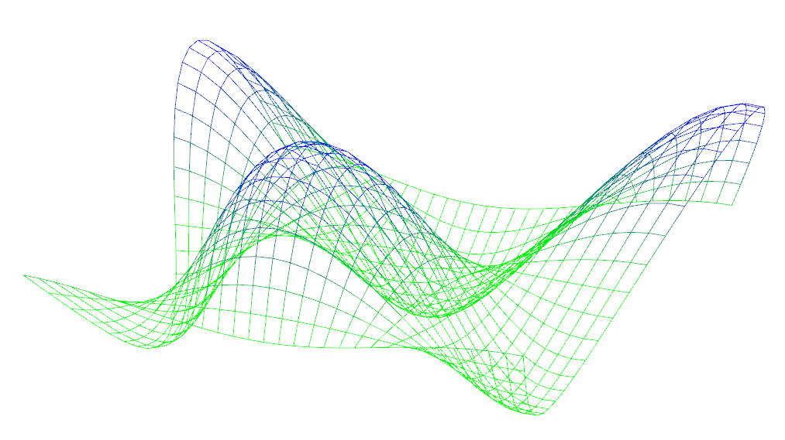
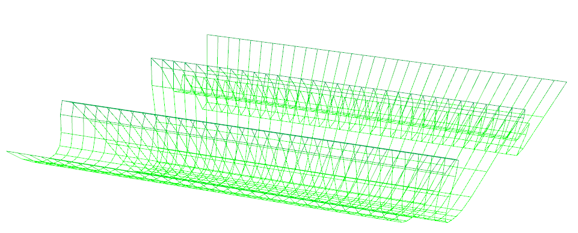

-------------------------------------------------------------------------------
CIS565: Project 5: WebGL
-------------------------------------------------------------------------------

Yuqin Shao
-------------------------------------------------------------------------------

-------------------------------------------------------------------------------
Demos Here
-------------------------------------------------------------------------------
In part 1, I did a very simple water wave. 
Click the screenshot below for demo

In part2, I added a skybox for the globe

-------------------------------------------------------------------------------

-------------------------------------------------------------------------------
PART 1 REQUIREMENTS:
-------------------------------------------------------------------------------
In Part 1, you are given code for:

* Drawing a VBO through WebGL
* Javascript code for interfacing with WebGL
* Functions for generating simplex noise

You are required to implement the following:

* A sin-wave based vertex shader:

* A simplex noise based vertex shader:

-------------------------------------------------------------------------------
PART 2 REQUIREMENTS:
-------------------------------------------------------------------------------
In Part 2, we are required to implement:

* Bump mapped terrain
* Rim lighting to simulate atmosphere
* Night-time lights on the dark side of the globe
* Specular mapping
* Moving clouds

And I imeplemented a skybox as extra feature.

-------------------------------------------------------------------------------
PERFORMANCE EVALUATION
-------------------------------------------------------------------------------
The performance evaluation is where you will investigate how to make your 
program more efficient using the skills you've learned in class. You must have
performed at least one experiment on your code to investigate the positive or
negative effects on performance. 

We encourage you to get creative with your tweaks. Consider places in your code
that could be considered bottlenecks and try to improve them. 

Each student should provide no more than a one page summary of their
optimizations along with tables and or graphs to visually explain any
performance differences.

