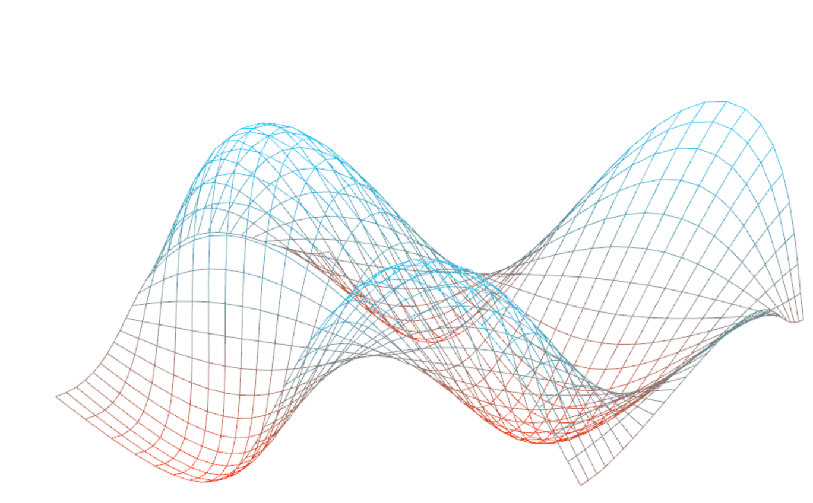

-------------------------------------------------------------------------------
CIS565: Project 5: WebGL
-------------------------------------------------------------------------------
Fall 2013
-------------------------------------------------------------------------------
Yingting Xiao
-------------------------------------------------------------------------------

-------------------------------------------------------------------------------
PART 1 FEATURES:
-------------------------------------------------------------------------------

Sine wave:

---

Simplex wave 1D:

---

Simplex wave 2D:

Instead of passing vec2(0.1*u_time, position) to simplexNoise, I pass vec2(position.x+0.25*u_time, position.y+0.25*u_time) to it. As a result, I get a nice 2D simplex wave.

---

Perlin wave 2D:

I followed the instructions on http://freespace.virgin.net/hugo.elias/models/m_perlin.htm to write my 2D perlin noise generator. 

Since WebGL doesn't support bitwise operations (used in the perlin noise tutorial for generating random numbers) or GLSL noise functions, I use this function to generate a pseudo-random number between 0 and 1 (credit: http://stackoverflow.com/questions/4200224/random-noise-functions-for-glsl/4275343#4275343):

float noise(float x, float y) {
  return fract(sin(dot(vec2(x,y) ,vec2(12.9898,78.233))) * 43758.5453);
}

It works perfectly well! For getting the perlin noise at a specific position I simply call perlin on vec2(position.x+0.25*u_time, position.y).

-------------------------------------------------------------------------------
PART 2 FEATURES:
-------------------------------------------------------------------------------

All required features:

---

Additional feature:

Procedural water rendering and animation using noise:

Version 1:

I turn off clouds in order to show the animation of water more clearly. In this version I use perlin noise as a bump map. I use the perlin noise values of a pixel's right and top points on the globe to compute the normal.

Version 2:

Since version 1 doesn't look very realistic, I tried a different approach: using perlin noise as a displacement map in the vertex shader. However, displacing the vertices only has an effect on the edge of the globe. In order to make the center of the globe look bumpy, I have to change the normals of vertices in the vertex shader.

In the vertex shader, I compute the spherical coordinates of the vertex, get the perlin noise value with vec2(theta, phi), and move the vertex along its normal by the perlin noise value. Then I add 0.001 to phi and get the displaced position at the new spherical coordinates. For theta I do the same thing. Finally I use the positions of the three points to compute the normal at the vertex.

This method gives me nice bumpy water on 1/4 of the globe, as shown in the image. However, the rest of the water looks really dark. I think the part on the sphere that looks nice is the part where phi and theta are both positive. I think the incorrect normals is probably due to my operations on the spherical coordinates. There might be something wrong in the way I convert cartesian coordinates to spherical coordinates, because phi is supposed to be in [0, 2*pi) and atan returns a value in (-0.5*pi, 0.5*pi). It was really hard to debug this, since GLSL doesn't have its debugger and the brightness of the global changes with the camera. I tried a bunch of different operations on spherical coordinates but couldn't get it to work right. If I have time to work on this, I will think about the math and try to figure out what the spherical coordinates are at different parts of the globe.

-------------------------------------------------------------------------------
PERFORMANCE EVALUATION
-------------------------------------------------------------------------------

I used stats.min.js to keep track of the time used in rendering every frame. I recorded the time per frame with different fragment shaders on the globe: basic texture, basic texture + specular map, basic texture + specular map + bump map, basic texture + specular map + bump map + cloud, basic texture + specular map + bump map + water. The time per frame is around 17ms for all these shaders, since requestAnimationFrame runs at a maximum of 60 times per second and the shaders are not complicated enough to slow things done.