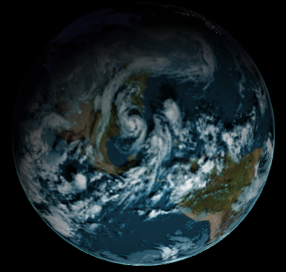

-------------------------------------------------------------------------------
WebGL Shaders (Simple Waves and Globe Rendering)
-------------------------------------------------------------------------------
Fall 2013
-------------------------------------------------------------------------------

Click any image to see a live demo.

<dl>

</dl>

-------------------------------------------------------------------------------
NOTE:
-------------------------------------------------------------------------------
This project requires any graphics card with support for a modern OpenGL 
pipeline. Any AMD, NVIDIA, or Intel card from the past few years should work 
fine, and every machine in the SIG Lab and Moore 100 is capable of running 
this project.

This project also requires a WebGL capable browser. The project is known to 
have issues with Chrome on windows, but Firefox seems to run it fine.

-------------------------------------------------------------------------------
Wave Rendering
-------------------------------------------------------------------------------
This section is just a simple demo of JS/WebGL Interaction and shader implementation.
Three different waveforms can be animated:

**Sine Wave**

* Open vert_wave.html to see this animation.
* The 2D sine wave is generated by varying only the height of each vertex in the grid.

**Simplex Wave**

* Open simplex_wave.html to see this animation.

**Water Surface Wave**

* Open water_wave.html to see this animation.
* Unlike the previous waves, this wave moves verticies in all directions.
* Each vertex is moved uniformly about a circle in some vertical plane
	* This plane can be set in the VS by changing waveDir
* The phase of each point is determined by their distance from the origin in the waveDir direction, resulting in linear wavefronts.
* This simulates in a very simple way how particles move in the surface of ocean waves.

-------------------------------------------------------------------------------
Globe Rendering
-------------------------------------------------------------------------------
Globe Renderer
  * left-click and drag moves the camera around
  * right-click and drag moves the camera in and out

Features:
*Soft twilight border

* Bump mapped terrain  

* Night-time lights on the dark side of the globe
* Sunrise-based rim lighting to simulate atmosphere
  * Rather than drawing uniform rim lighting, I only shade the sunward side. This leads to cool sunrise effects:

* Specular mapping (only water is specularly reflective)
* Moving clouds with procedurally generated shadows.

