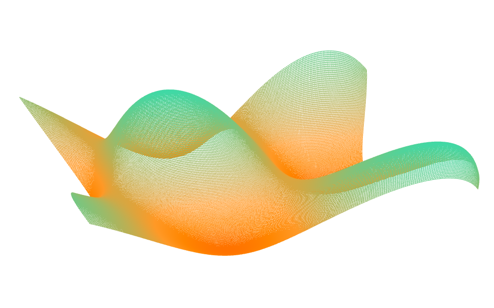
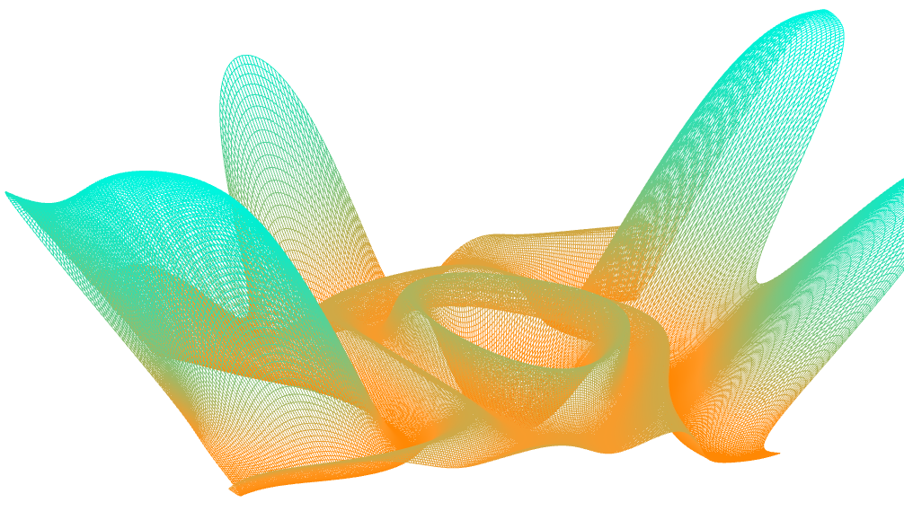

-------------------------------------------------------------------------------
CIS565: Project 5: WebGL
-------------------------------------------------------------------------------
Fall 2013

---
Part 1: Vertex Shader Shenanigans
---

Some screenshots to begin!

Details:
* The simple wave is just a sin wave that goes up and down based on the x and z coordinage
* The simplex noise function is used in 2D to generate a moving height field sort of effect.
* The last one is an infinitely tiled, pseudo random terrain generation

For the pseudo-random infinitely tiled terrain generation, I used a combination of a tiled noise texture along with the simplex noise function to create a time-dependent but yet infinitely tiled terrain which is false colored for visualization.
